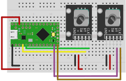

# Keyboard navigation through rotary encoders

Sometimes you have an app that allows to navigate a 1D list or a 2D area using
the arrow keys. Wouldn't it be nice to do the same thing via rotary encoders and
a micro controller? You turn the knob a certain number of steps and a key press
is triggered. Easy as that.

## Build instructions

This project requires the [PlatformIO] toolkit to be installed on your system.

Connect a [Teensy LC] board to your system and run

```shell
pio run
pio run -t upload
```

There is also a second configuration that uses the <kbd>W</kbd><kbd>A</kbd><kbd>S</kbd><kbd>D</kbd> keys instead of <kbd>↑</kbd><kbd>←</kbd><kbd>↓</kbd><kbd>→</kbd>:

```shell
pio run -e teensylc-wasd
pio run -e teensylc-wasd -t upload
```

## Additional configuration

Custom pins and keys codes can be configured by adjusting the respective macros in `src/main.cpp`. It is also possible to adjust these values via build flags (see `platformio.ini`).

It should also be possible to use [other Teensy boards] by modifying `platformio.ini`. Pull requests are welcome.

## Wiring



## Credits

Developed by Christian Stussak, IMAGINARY gGmbH.

## License

Copyright 2021 IMAGINARY gGmbH

Licensed under the Apache License, Version 2.0 (see `LICENSE`).

[platformio]: https://platformio.org
[teensy lc]: https://www.pjrc.com/teensy/teensyLC.html
[other teensy boards]: https://www.pjrc.com/store/
